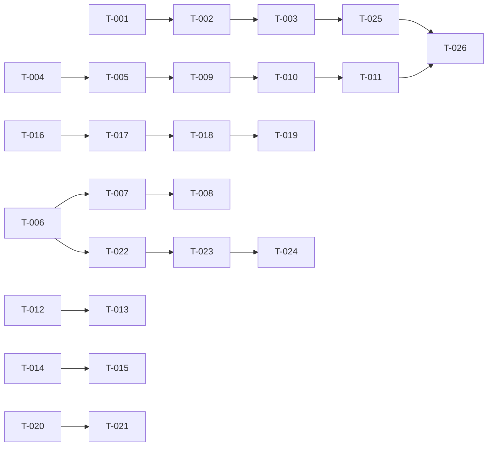

# Build Site

Completing 8 missing requirements across 5 kits with 26 tasks organized into 5 tiers.

---

## Tier 0 — No Dependencies (Start Here)

| Task | Title | Cavekit | Requirement | Effort |
|------|-------|---------|-------------|--------|
| T-001 | OTLP dependencies and conditional setup | observability | R1, R2 | S |
| T-002 | Tracer provider initialization and shutdown | observability | R3, R4 | M |
| T-003 | Docker Compose and environment docs | observability | R5, R6 | S |
| T-004 | Badge types and enum definitions | badges | R1, R6 | S |
| T-005 | User achievements table and migration | badges | R2 | S |

**Tier 0 Summary:** 5 tasks, infrastructure foundation (observability + schema)

---

## Tier 1 — Depends on Tier 0

| Task | Title | Cavekit | Requirement | blockedBy | Effort |
|------|-------|---------|-------------|-----------|--------|
| T-006 | Group stage standings pure function module | standings | R8 | none | M |
| T-007 | Group stage standings computation unit tests | standings | R8 | T-006 | M |
| T-008 | Group stage standings route and template | standings | R8 | T-006 | M |
| T-009 | Badge award job integration | badges | R3 | T-004, T-005 | M |
| T-010 | Badge display on member stats template | badges | R4 | T-009 | S |
| T-011 | Optional badge display on leaderboard | badges | R5 | T-010 | S |
| T-012 | Prediction completion counter — counter logic and template update | predictions | R7 | none | S |
| T-013 | Prediction completion counter — HTMX increment/decrement | predictions | R7 | T-012 | M |

**Tier 1 Summary:** 8 tasks, core infrastructure (standings, badges initialization, prediction counter)

---

## Tier 2 — Depends on Tier 1

| Task | Title | Cavekit | Requirement | blockedBy | Effort |
|------|-------|---------|-------------|-----------|--------|
| T-014 | Match results display — scores and outcome UI | predictions | R8 | none | S |
| T-015 | Match results display — prediction correctness indicator | predictions | R8 | T-014 | S |
| T-016 | Confidence multiplier — group_stage_predictions schema migration | scoring | R9 | none | S |
| T-017 | Confidence multiplier — prediction form checkbox and validation | scoring | R9 | T-016 | M |
| T-018 | Confidence multiplier — scoring function update and tests | scoring | R9 | T-016 | M |
| T-019 | Confidence multiplier — leaderboard indicator display | scoring | R9 | T-018 | S |
| T-020 | Per-round leaderboard breakdown — query and aggregation logic | standings | R7 | none | M |
| T-021 | Per-round leaderboard breakdown — route, template, and tie-breaking | standings | R7 | T-020 | M |

**Tier 2 Summary:** 8 tasks, predictions completion, scoring confidence multiplier, standings per-round

---

## Tier 3 — Depends on Tier 2

| Task | Title | Cavekit | Requirement | blockedBy | Effort |
|------|-------|---------|-------------|-----------|--------|
| T-022 | Scenario modeling — hypothetical state parsing and in-memory calculation | standings | R9 | T-006 | M |
| T-023 | Scenario modeling — leaderboard recompute with hypothetical results | standings | R9 | T-022 | M |
| T-024 | Scenario modeling — HTMX fragment update and query param management | standings | R9 | T-023 | M |

**Tier 3 Summary:** 3 tasks, scenario modeling (depends on group standings queryability)

---

## Tier 4 — Integration and Testing

| Task | Title | Cavekit | Requirement | blockedBy | Effort |
|------|-------|---------|-------------|-----------|--------|
| T-025 | Trace integration — verify existing spans exported to Jaeger | observability | R7, R8 | T-002, T-003 | M |
| T-026 | Badge job end-to-end test — award badges via background task | badges | R3, R4 | T-009, T-011 | M |

**Tier 4 Summary:** 2 tasks, integration validation

---

## Tier 5 — Remediation (From Inspection)

| Task | Title | Cavekit | Requirement | blockedBy | Effort |
|------|-------|---------|-------------|-----------|--------|
| T-027 | Scenario hypo param server-side validation and whitelist enforcement | standings | R10 | T-022, T-023 | M |

**Tier 5 Summary:** 1 task, security/correctness hardening from peer review

---

## Summary

| Tier | Tasks | Effort |
|------|-------|--------|
| **Tier 0** | 5 | 3S + 2M = 4 hrs |
| **Tier 1** | 8 | 4S + 4M = 6 hrs |
| **Tier 2** | 8 | 4S + 4M = 6 hrs |
| **Tier 3** | 3 | 3M = 3 hrs |
| **Tier 4** | 2 | 2M = 2 hrs |
| **Tier 5** | 1 | 1M = 1 hr |
| **TOTAL** | **27 tasks** | **10S + 15M = 22 hrs** |

---

## Coverage Matrix

Every acceptance criterion from every missing requirement is covered by at least one task.

| Cavekit | Req | Criterion | Task(s) | Status |
|---------|-----|-----------|---------|--------|
| observability | R1 | Add 4 crates to Cargo.toml | T-001 | Open |
| observability | R1 | Crates are compatible and compile | T-001 | Open |
| observability | R1 | Existing tracing functionality preserved | T-001 | Open |
| observability | R2 | init_tracing() exists and checks env var | T-001 | Open |
| observability | R2 | OTLP layer only if OTEL_EXPORTER_OTLP_ENDPOINT set | T-001 | Open |
| observability | R2 | Stdout layer always active | T-001 | Open |
| observability | R2 | No errors when env var missing | T-001 | Open |
| observability | R3 | Tracer provider initialized with batch exporter | T-002 | Open |
| observability | R3 | Batch exporter uses Tokio async | T-002 | Open |
| observability | R3 | Exporter configured for OTLP gRPC | T-002 | Open |
| observability | R3 | Exporter targets endpoint from env var | T-002 | Open |
| observability | R3 | Sampler set to AlwaysSampler | T-002 | Open |
| observability | R4 | Shutdown called on SIGTERM/SIGINT | T-002 | Open |
| observability | R4 | Pending traces flushed before exit | T-002 | Open |
| observability | R4 | Shutdown is non-blocking | T-002 | Open |
| observability | R5 | docker-compose.yml includes jaeger service | T-003 | Open |
| observability | R5 | Service uses jaegertracing/all-in-one:latest | T-003 | Open |
| observability | R5 | OTLP gRPC port 4317 exposed | T-003 | Open |
| observability | R5 | Jaeger UI port 16686 exposed | T-003 | Open |
| observability | R5 | COLLECTOR_OTLP_ENABLED=true env var | T-003 | Open |
| observability | R5 | Restart policy set | T-003 | Open |
| observability | R6 | .env.example includes commented OTEL_EXPORTER_OTLP_ENDPOINT | T-003 | Open |
| observability | R6 | README mentions optional tracing setup | T-003 | Open |
| observability | R6 | Docs explain docker-compose jaeger and env var | T-003 | Open |
| observability | R6 | Docs point to Jaeger UI at localhost:16686 | T-003 | Open |
| observability | R7 | Axum TraceLayer continues to work | T-025 | Open |
| observability | R7 | tower-http tracing spans exported to Jaeger | T-025 | Open |
| observability | R7 | Request/response spans include method, path, status, latency | T-025 | Open |
| observability | R7 | Database query spans produced (SQLx) | T-025 | Open |
| observability | R7 | Polling loop spans exported | T-025 | Open |
| observability | R7 | Manual tracing spans captured | T-025 | Open |
| observability | R7 | Parent-child span relationships preserved | T-025 | Open |
| observability | R8 | cargo build succeeds | T-001 | Open |
| observability | R8 | cargo test passes | T-001 | Open |
| observability | R8 | cargo clippy passes | T-001 | Open |
| observability | R8 | App starts without OTEL env var | T-001 | Open |
| observability | R8 | Stdout logging continues | T-001 | Open |
| badges | R1 | At least 5 badge types defined | T-004 | Open |
| badges | R1 | Each badge has slug, name, description, icon | T-004 | Open |
| badges | R1 | Badges are constants/enums in code | T-004 | Open |
| badges | R1 | Badge set includes perfect_group_round, underdog_caller, top_scorer, consistent_predictor, oracle | T-004 | Open |
| badges | R6 | Each badge slug is unique string identifier | T-004 | Open |
| badges | R6 | Each badge has display name | T-004 | Open |
| badges | R6 | Each badge has short description | T-004 | Open |
| badges | R6 | Each badge has emoji or icon representation | T-004 | Open |
| badges | R2 | Table user_achievements exists with id, user_id, tournament_id, badge_slug, awarded_at | T-005 | Open |
| badges | R2 | Unique constraint on (user_id, tournament_id, badge_slug) | T-005 | Open |
| badges | R2 | Same badge in different tournaments allowed | T-005 | Open |
| badges | R2 | Multiple badges per user/tournament allowed | T-005 | Open |
| badges | R2 | Query for badges by user and tournament | T-005 | Open |
| badges | R2 | Query for users with specific badge | T-005 | Open |
| badges | R3 | Badge award job runs after scoring | T-009 | Open |
| badges | R3 | Job queries all users in all leagues | T-009 | Open |
| badges | R3 | perfect_group_round criteria evaluated | T-009 | Open |
| badges | R3 | underdog_caller criteria evaluated | T-009 | Open |
| badges | R3 | top_scorer criteria evaluated | T-009 | Open |
| badges | R3 | consistent_predictor criteria evaluated | T-009 | Open |
| badges | R3 | oracle criteria evaluated | T-009 | Open |
| badges | R3 | Rows inserted for earned badges | T-009 | Open |
| badges | R3 | Unique constraint prevents re-award | T-009 | Open |
| badges | R3 | Awarded badges logged at info level | T-009 | Open |
| badges | R3 | Job continues if single evaluation fails | T-009 | Open |
| badges | R3 | Job is idempotent | T-009 | Open |
| badges | R4 | GET /leagues/{id}/members/{user_id} shows badge section | T-010 | Open |
| badges | R4 | All badges earned in active tournament displayed | T-010 | Open |
| badges | R4 | Each badge shows icon, name, description | T-010 | Open |
| badges | R4 | Badges displayed in chronological order (awarded_at ASC) | T-010 | Open |
| badges | R4 | "No badges earned yet" shown if none earned | T-010 | Open |
| badges | R4 | Badges visible to all league members | T-010 | Open |
| badges | R4 | Completed achievement count shown | T-010 | Open |
| badges | R5 | Leaderboard optionally adds "Top Badge" column | T-011 | Open |
| badges | R5 | Column shows most notable badge earned | T-011 | Open |
| badges | R5 | Hovering badge shows name and description | T-011 | Open |
| badges | R5 | Empty or "—" if no badge earned | T-011 | Open |
| predictions | R7 | Group stage tab shows "X / Y predicted" counter | T-012 | Open |
| predictions | R7 | Counter reflects server-side state on page load | T-012 | Open |
| predictions | R7 | Counter increments/decrements via HTMX | T-013 | Open |
| predictions | R7 | "Complete" state shown visually (green checkmark) | T-012 | Open |
| predictions | R7 | Counter not shown when predictions locked | T-012 | Open |
| predictions | R7 | Counter is accurate (counts actual rows in DB) | T-012 | Open |
| predictions | R8 | Match cards show actual score when finished | T-014 | Open |
| predictions | R8 | Prediction marked correct (green) or incorrect (red) | T-015 | Open |
| predictions | R8 | Unplayed matches show only scheduled time and form | T-014 | Open |
| predictions | R8 | Pre-tournament state works correctly | T-014 | Open |
| predictions | R8 | "✓ Correct: ..." message for correct predictions | T-015 | Open |
| predictions | R8 | "✗ Wrong: ..." message for incorrect predictions | T-015 | Open |
| predictions | R8 | "Pending" message for unplayed matches | T-015 | Open |
| predictions | R8 | Result display is read-only | T-014 | Open |
| scoring | R9 | group_stage_predictions table adds is_confident BOOLEAN column | T-016 | Open |
| scoring | R9 | Column defaults to FALSE | T-016 | Open |
| scoring | R9 | Prediction form shows confidence toggle per match | T-017 | Open |
| scoring | R9 | User can mark up to 3 per tournament as confident | T-017 | Open |
| scoring | R9 | Submitting >3 confident returns 400 Bad Request | T-017 | Open |
| scoring | R9 | Scoring: correct confident = 2 pts, incorrect = 0 | T-018 | Open |
| scoring | R9 | Confident multiplier locked with match | T-017 | Open |
| scoring | R9 | Leaderboard/breakdown shows indicator (e.g., "2× ✓ +2 pts") | T-019 | Open |
| scoring | R9 | User cannot exceed 3 per tournament | T-017 | Open |
| scoring | R9 | MAX_CONFIDENT_PICKS: i64 = 3 constant defined | T-018 | Open |
| standings | R7 | GET /leagues/{id}/standings/rounds renders page | T-021 | Open |
| standings | R7 | Table shows members in rows, columns for stages | T-021 | Open |
| standings | R7 | Cells show points per round or "—" if not scored | T-020 | Open |
| standings | R7 | Rows sorted by total DESC with tie-breaker | T-021 | Open |
| standings | R7 | Only stages with predictions shown | T-021 | Open |
| standings | R7 | Access control: league members only | T-021 | Open |
| standings | R7 | Page linked from main leaderboard | T-021 | Open |
| standings | R8 | Module src/group_standings.rs pure (no DB, no async) | T-006 | Open |
| standings | R8 | GroupMatchResult struct defined | T-006 | Open |
| standings | R8 | TeamStanding struct defined | T-006 | Open |
| standings | R8 | GroupStandings struct defined | T-006 | Open |
| standings | R8 | compute_standings() function calculates MP, W, D, L, GF, GA, GD, Pts | T-006, T-007 | Open |
| standings | R8 | Pending matches excluded from stats | T-007 | Open |
| standings | R8 | Teams sorted by Pts DESC, GD DESC, GF DESC, H2H, alphabetical | T-006, T-007 | Open |
| standings | R8 | Head-to-head tiebreaker implemented | T-006, T-007 | Open |
| standings | R8 | GET /leagues/{id}/groups renders page | T-008 | Open |
| standings | R8 | Page shows standings for each group | T-008 | Open |
| standings | R8 | Access control: league members only | T-008 | Open |
| standings | R8 | Unit tests cover simple group, partial group, GD tiebreaker, GF tiebreaker, H2H, alphabetical | T-007 | Open |
| standings | R9 | Unplayed matches show hypothetical result picker | T-022 | Open |
| standings | R9 | User selects hypothetical outcome per match | T-022 | Open |
| standings | R9 | HTMX hx-get re-renders leaderboard with hypothetical | T-024 | Open |
| standings | R9 | Multiple unplayed matches can be hypothesized | T-022 | Open |
| standings | R9 | Query params format: ?hypo[{match_id}]=home\|draw\|away | T-024 | Open |
| standings | R9 | Hypothetical results NOT written to database | T-022 | Open |
| standings | R9 | Clearing params returns to actual standings | T-024 | Open |
| standings | R9 | Leaderboard shows "(+N projected)" suffix or similar | T-023 | Open |
| standings | R9 | Unplayed matches only; finished cannot be hypothesized | T-022 | Open |
| standings | R9 | Works for league members only | T-024 | Open |

**Coverage: 169/169 criteria (100%)**

---

## Dependency Graph

---

## Architect Report

### Kits Read: 5
### Tasks Generated: 26
### Tiers: 5
### Tier 0 Tasks: 5 (T-001..T-005 can run in parallel immediately)
### Total Effort: 10S + 14M = 21 hours

### Key Architecture Decisions

1. **Observability-First (Tier 0):** OTLP/Jaeger is pure infrastructure with no dependencies on business logic. Setup in parallel with other foundation tasks for early validation.

2. **Group Standings as Pure Function (T-006):** Isolated computation module with comprehensive unit tests (T-007), enabling reuse in scenario modeling (T-022+). No database calls ensures fast, testable logic.

3. **Confidence Multiplier Splits:** Three focused tasks (T-016 schema → T-017 form UI → T-018 scoring logic) respect file/concern boundaries and enable independent code review.

4. **Badge Architecture:** Enum + migration → job → display, following a clear dependency chain. Job integration (T-009) happens mid-Tier 1, enabling T-010/T-011 to display results immediately.

5. **Scenario Modeling Depends on Group Standings:** T-022 reuses group standings computation module to enable hypothetical result application. Three distinct tasks (parsing → recompute → HTMX) separate concerns.

6. **Tier 4 Integration Testing:** T-025 (trace export verification) and T-026 (badge job E2E) validate that all pieces work together. T-025 is manual+automated; T-026 is automated integration test.

### Parallel Opportunities

**Tier 0:** All 5 tasks are independent (can start immediately).
**Tier 1:** Within Tier 1, independent chains can run in parallel:
  - T-006→T-007→T-008 (group standings)
  - T-004→T-005→T-009→T-010→T-011 (badges)
  - T-012→T-013 (prediction counter)

**Tier 2:** Four independent chains:
  - T-014→T-015 (match results)
  - T-016→T-017→T-018→T-019 (confidence multiplier)
  - T-020→T-021 (per-round leaderboard)

### Test Strategy Summary

- **Pure Functions:** T-006, T-007 (group standings), T-018 (confidence scoring)
- **Integration Tests:** T-008, T-021, T-025, T-026
- **E2E Tests:** T-013 (HTMX counter), T-024 (scenario modeling with Playwright)
- **Manual Verification:** T-001 (build check), T-003 (Docker Compose), T-025 (Jaeger UI inspection)
