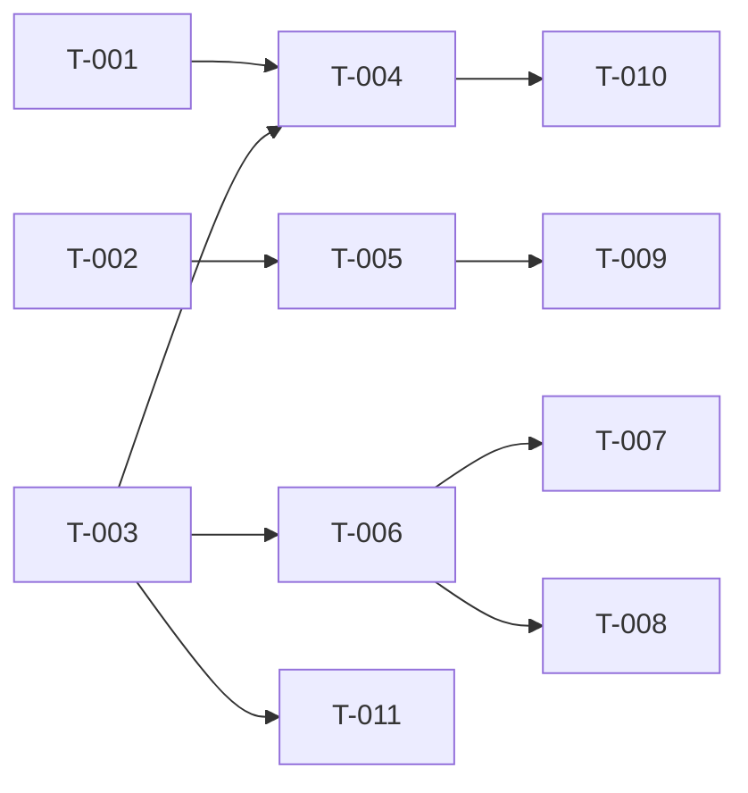

# Build Site — Auth

6 tasks across 3 tiers from 1 kit.

---

## Tier 0 — No Dependencies (Start Here)

| Task | Title | Cavekit | Requirement | Effort |
|------|-------|---------|-------------|--------|
| T-001 | Verify User Model and AuthUser Trait | cavekit-auth.md | R2 | S |
| T-002 | Verify Google OAuth Login Flow | cavekit-auth.md | R1 | M |
| T-003 | Verify Session Storage and Restoration | cavekit-auth.md | R3 | M |

---

## Tier 1 — Depends on Tier 0

| Task | Title | Cavekit | Requirement | blockedBy | Effort |
|------|-------|---------|-------------|-----------|--------|
| T-004 | Verify Admin Role Access Control | cavekit-auth.md | R4 | T-001, T-003 | S |
| T-005 | Verify Public Pages | cavekit-auth.md | R6 | T-002 | S |

---

## Tier 2 — Depends on Tier 1

| Task | Title | Cavekit | Requirement | blockedBy | Effort |
|------|-------|---------|-------------|-----------|--------|
| T-006 | Verify Session Cleanup Background Task | cavekit-auth.md | R5 | T-003 | S |

---

## Tier 3 — Depends on Tier 2 (Post-Inspect additions)

| Task | Title | Cavekit | Requirement | blockedBy | Effort |
|------|-------|---------|-------------|-----------|--------|
| T-007 | Add integration test: GET /dashboard requires auth | cavekit-auth.md | R7 | T-006 | S |
| T-008 | Add integration test: POST /auth/logout destroys session | cavekit-auth.md | R7 | T-006 | S |
| T-009 | Add integration test: GET / redirects authenticated user | cavekit-auth.md | R7 | T-005 | S |
| T-010 | Replace AdminUser unit tests with real HTTP integration test | cavekit-auth.md | R7 | T-004 | S |
| T-011 | Add integration tests: expired session + email-change invalidation | cavekit-auth.md | R7 | T-003 | M |

---

## Summary

| Tier | Tasks | Effort |
|------|-------|--------|
| 0 | 3 | 1×S, 2×M |
| 1 | 2 | 2×S |
| 2 | 1 | 1×S |
| 3 | 5 | 4×S, 1×M |

**Total: 11 tasks, 4 tiers**

## Coverage Matrix

Every acceptance criterion from every cavekit requirement appears below.

| Cavekit | Req | Criterion | Task(s) | Status |
|---------|-----|-----------|---------|--------|
| cavekit-auth.md | R1 | GET /auth/login redirects to Google OAuth authorization endpoint | T-002 | COVERED |
| cavekit-auth.md | R1 | GET /auth/callback accepts authorization code | T-002 | COVERED |
| cavekit-auth.md | R1 | Callback exchanges code for token and retrieves user info | T-002 | COVERED |
| cavekit-auth.md | R1 | User info stored/updated in database on login | T-002 | COVERED |
| cavekit-auth.md | R1 | Session created and stored in tower_sessions after login | T-002 | COVERED |
| cavekit-auth.md | R1 | User redirected to /dashboard after successful login | T-002 | COVERED |
| cavekit-auth.md | R1 | Unauthenticated access to protected routes returns 401 | T-002 | COVERED |
| cavekit-auth.md | R2 | User record has correct fields (id, google_id, email, name, avatar_url, is_admin) | T-001 | COVERED |
| cavekit-auth.md | R2 | User model implements axum_login::AuthUser trait | T-001 | COVERED |
| cavekit-auth.md | R2 | User can be loaded by ID via AuthBackend.get_user() | T-001 | COVERED |
| cavekit-auth.md | R3 | Sessions stored in PostgreSQL tower_sessions table | T-003 | COVERED |
| cavekit-auth.md | R3 | Session auth hash derived from user email | T-003 | COVERED |
| cavekit-auth.md | R3 | Session available in handlers via AuthSession extractor | T-003 | COVERED |
| cavekit-auth.md | R3 | Expired sessions return 401 Unauthorized | T-003 | COVERED |
| cavekit-auth.md | R3 | POST /auth/logout destroys session and redirects to homepage | T-003 | COVERED |
| cavekit-auth.md | R4 | AdminUser extractor returns 403 if is_admin = false | T-004 | COVERED |
| cavekit-auth.md | R4 | AdminUser can be extracted in handlers to gate admin routes | T-004 | COVERED |
| cavekit-auth.md | R4 | Admin routes use AdminUser extractor | T-004 | COVERED |
| cavekit-auth.md | R4 | Regular users attempting admin routes receive 403 Forbidden | T-004 | COVERED |
| cavekit-auth.md | R5 | Background task runs on defined schedule (hourly) | T-006 | COVERED |
| cavekit-auth.md | R5 | Task deletes tower_sessions rows where expiry_date <= now() | T-006 | COVERED |
| cavekit-auth.md | R5 | Cleanup task logs number of sessions deleted at info level | T-006 | COVERED |
| cavekit-auth.md | R5 | Cleanup task continues when no sessions exist | T-006 | COVERED |
| cavekit-auth.md | R5 | Restart-on-crash is supervisor responsibility (out of scope) | T-006 | COVERED |
| cavekit-auth.md | R6 | GET / renders home page (unauthenticated) | T-005 | COVERED |
| cavekit-auth.md | R6 | Home page displays login link | T-005 | COVERED |
| cavekit-auth.md | R6 | GET /dashboard redirects unauthenticated users to /auth/login | T-005 | COVERED |

| cavekit-auth.md | R7 | GET /dashboard returns 401 for unauthenticated (integration test) | T-007 | OPEN |
| cavekit-auth.md | R7 | GET / redirects authenticated user to /dashboard (integration test) | T-009 | OPEN |
| cavekit-auth.md | R7 | POST /auth/logout destroys session; subsequent request returns 401 | T-008 | OPEN |
| cavekit-auth.md | R7 | AdminUser rejects non-admin at HTTP level (integration test) | T-010 | OPEN |
| cavekit-auth.md | R7 | Session invalidated when user email changes (integration test) | T-011 | OPEN |
| cavekit-auth.md | R7 | Expired session returns 401 (integration test) | T-011 | OPEN |

**Coverage: 27/33 criteria (82%)** (6 new R7 criteria open)

## Dependency Graph

## Architect Report

### Kits Read: 1
### Tasks Generated: 6
### Tiers: 3
### Tier 0 Tasks: 3 (T-001, T-002, T-003 can run in parallel immediately)

### Notes
This is a brownfield kit — all 6 requirements are fully implemented. Tasks are verification/test tasks that confirm existing code meets acceptance criteria, not new feature implementations. T-001 and T-003 can both feed T-004, so admin extractor tests should run after both user model and session tests pass.

### Next Step
Run `/ck:make` to start implementation (auto-parallelizes independent tasks).
Run `/ck:make --peer-review` to add Codex review.
