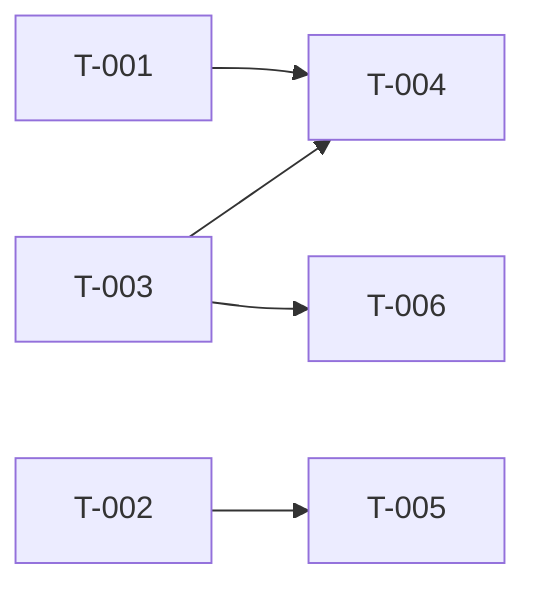

# Build Site — Auth

6 tasks across 3 tiers from cavekit-auth.md (brownfield — verification tasks).

---

## Tier 0 — No Dependencies (Start Here)

| Task | Title | Cavekit | Requirement | Effort |
|------|-------|---------|-------------|--------|
| T-001 | Verify User Model schema and AuthUser trait | cavekit-auth | R2 | M |
| T-002 | Verify Google OAuth login flow to callback | cavekit-auth | R1 | M |
| T-003 | Verify session storage in tower_sessions table | cavekit-auth | R3 | M |

---

## Tier 1 — Depends on Tier 0

| Task | Title | Cavekit | Requirement | blockedBy | Effort |
|------|-------|---------|-------------|-----------|--------|
| T-004 | Verify AdminUser extractor and access control | cavekit-auth | R4 | T-001, T-003 | M |
| T-005 | Verify public pages (home and dashboard redirect) | cavekit-auth | R6 | T-002 | S |

---

## Tier 2 — Depends on Tier 1

| Task | Title | Cavekit | Requirement | blockedBy | Effort |
|------|-------|---------|-------------|-----------|--------|
| T-006 | Verify session cleanup background task | cavekit-auth | R5 | T-003 | M |

---

## Summary

| Tier | Tasks | Effort |
|------|-------|--------|
| Tier 0 | 3 | 3M |
| Tier 1 | 2 | M + S |
| Tier 2 | 1 | M |
| **Total** | **6** | **5M + S** |

**Total: 6 tasks, 3 tiers**

---

## Coverage Matrix

| Cavekit | Req | Criterion | Task(s) | Status |
|---------|-----|-----------|---------|--------|
| cavekit-auth | R1 | GET `/auth/login` redirects to Google OAuth | T-002 | Verify |
| cavekit-auth | R1 | Callback handler accepts authorization code | T-002 | Verify |
| cavekit-auth | R1 | Exchanges authorization code for access token | T-002 | Verify |
| cavekit-auth | R1 | Stores/updates user info in DB | T-002 | Verify |
| cavekit-auth | R1 | Creates session in tower_sessions table | T-002, T-003 | Verify |
| cavekit-auth | R1 | Redirects to `/dashboard` after login | T-002 | Verify |
| cavekit-auth | R1 | 401 Unauthorized for protected routes | T-005 | Verify |
| cavekit-auth | R2 | User model has correct schema (7 fields) | T-001 | Verify |
| cavekit-auth | R2 | Implements `axum_login::AuthUser` trait | T-001 | Verify |
| cavekit-auth | R2 | Can load user by ID via `AuthBackend.get_user()` | T-001 | Verify |
| cavekit-auth | R3 | Sessions stored in tower_sessions table | T-003 | Verify |
| cavekit-auth | R3 | Session auth hash from user email | T-003 | Verify |
| cavekit-auth | R3 | AuthSession extractor available in handlers | T-003 | Verify |
| cavekit-auth | R3 | Expired sessions return 401 | T-003 | Verify |
| cavekit-auth | R3 | POST `/auth/logout` destroys session | T-005 | Verify |
| cavekit-auth | R4 | `AdminUser` extractor exists | T-004 | Verify |
| cavekit-auth | R4 | Returns 403 Forbidden if `is_admin = false` | T-004 | Verify |
| cavekit-auth | R4 | AdminUser gates admin routes | T-004 | Verify |
| cavekit-auth | R4 | Regular users get 403 on admin routes | T-004 | Verify |
| cavekit-auth | R5 | Background task runs on schedule | T-006 | Verify |
| cavekit-auth | R5 | Deletes rows where `expiry_date <= now()` | T-006 | Verify |
| cavekit-auth | R5 | Logs number of sessions deleted | T-006 | Verify |
| cavekit-auth | R5 | Continues if no sessions to clean | T-006 | Verify |
| cavekit-auth | R6 | GET `/` renders home page | T-005 | Verify |
| cavekit-auth | R6 | Home page displays login link | T-005 | Verify |
| cavekit-auth | R6 | GET `/dashboard` is protected | T-005 | Verify |

**Coverage: 26/26 criteria (100%)**

---

## Dependency Graph

---

## Architect Report

### Kits Read: 1
### Tasks Generated: 6
### Tiers: 3
### Tier 0 Tasks: 3

### Brownfield Status
All requirements in cavekit-auth.md are marked as **complete** with source files identified. Tasks focus on **verification** — writing integration and unit tests to confirm existing implementation meets each acceptance criterion.

### Key Decisions
- **T-001, T-002, T-003** form the foundation (Tier 0) — verifying core user, OAuth, and session infrastructure.
- **T-004, T-005** depend on Tier 0 — verifying admin access control and public page flow.
- **T-006** (session cleanup) depends on T-003 — requires session table before cleanup can be tested.

### Next Step
Run `/ck:make` to generate individual task plans.
